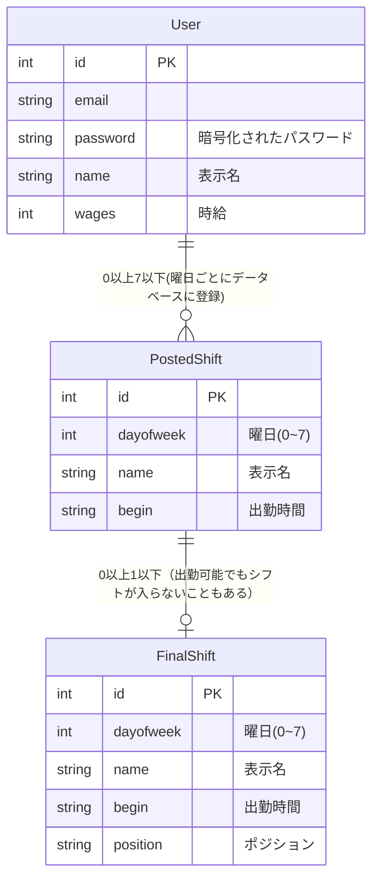

# 成果物
https://github.com/ynori123/new_sadmin

http://157.7.87.159

## 開発に至った経緯
PythonのFlaskを用いたアルバイト先のシフト管理Webアプリケーションです。アルバイト先では、シフトを提出する際、店長の個人LINEもしくは紙に書いて提出し、店長がシフトを作る際は、LINEで提出されたシフトも一度紙に書き写して整理してからExcelシートにシフトを作成し、公開するという流れでアルバイトのシフトを管理していました。私はそこに着目し、シフトの提出から公開まで1つのWebアプリケーションにすることができれば、店長の負担が軽減する上、シフトがより早くアルバイトに公開することができると考えたので、このWebアプリケーションを作成しました。

## 技術スタック
- メイン：Python Flask 2.2.3
- テンプレートエンジン：Jinja2 3.1.2
- データベース：Sqlite3
- ORM：Flask-SQLAlchemy
- 実行環境：Conoha VPS

数十人程度の従業員が使う小規模なアプリケーションのため、データベースは導入しやすいSqlite3を利用しました。

## 役割
個人開発です。仕様設計からデプロイまで私が行いました。

## 開発内容
### 概要
アルバイトは、従業員ページからログインし、シフトを提出します。シフトを提出すると、内容は`PostedShift`データベースに保存されます。店長は、`PostedShift`の内容が確認できる`シフトを確認`画面から提出されたシフトを確認し、シフトを編集します。
`シフトを確認`画面は次の図のとおりです。

名前と出勤可能時間の列には、出勤できないと提出したアルバイトの情報をのぞいた`PostedShift`の内容が表示されており、それを加味して出勤させる人の出勤時間とポジションを入力することで、`FinalShift`データベースに情報が反映され、アルバイトがシフトを確認できるようになります。

### データベース

## 苦労した点
最も苦労したところは、設計です。設計する際、どうすればよりシンプルなコードでシンプルなシステムになり、店長もアルバイトもより使いやすくなるかを考えルノに苦労しました。特に工夫した点は、1度シフトを提出しても、書き換えできるようにしている点です。現在の携帯では、アルバイトは、LINEでシフトを提出した際、店長の既読がついたら店長がもうすでに紙に提出したシフトを書き写しているので、シフトを出し直せないという問題点がありました。このアプリケーションでは、店長のシフトを作成する際の負担だけでなく、その問題のようなアルバイトの負担も解消することができるように工夫しました。

## 改善点
実際にあるバイト先で一週間運用していただき、アルバイトや社員さんからフィードバックを集めたところ、パソコンでシフトを編集する店長からはすごく便利だと好評だったが、アルバイトからは、スマートフォンのUIが使いにくいとの指摘を受けたので、現在スマートフォン向けUIの改修を行っています。

# 自己PR・志望理由

私の強みは主体性を持って興味のある領域に深く没頭することができることです。高専3年生の夏に行ったサイバーセキュリティの実験をきっかけに、サイバーセキュリティに強い関心を抱くようになりました。その後、サイバーセキュリティに関する勉強会やコンテストに積極的に参加し、特にサイバーサクラというコンテストでは決勝に進出し、4位という成績を収めました。

これらの経験から、自分の技術力にはまだ向上の余地があると感じ、さらなる成長を追求する意欲を抱いています。また、奈良高専の授業でのグループ活動では、プロジェクトマネージャやリーダーとして積極的に参加し、グループメンバーの進捗管理や時間管理を行いました。プロジェクトの最終成果発表では高い評価を受けると同時に、改善点を洗い出し、今後の活動に生かすことができました。

これらの経験を通じて、新しい知識や技術を積極的に取り入れる能力を身につけました。私は貴社のインターンシップのスクラム開発において、自身の主体性を、チームと協力しながらプロダクトデザイナーと連携し、ウェブアプリケーションの開発で活かしたいと考えています。Ruby on RailsやReact(TypeScript)といった開発環境に加え、SmartHRのプロダクトエンジニアのサポートも受けられ、ますます成長できる環境に魅力を感じたので、貴社のインターンシップに参加したいと考えております。

# その他リンクなど

- Github : https://github.com/ynori123
- Twitter : https://twitter.com/seaweed_CTF