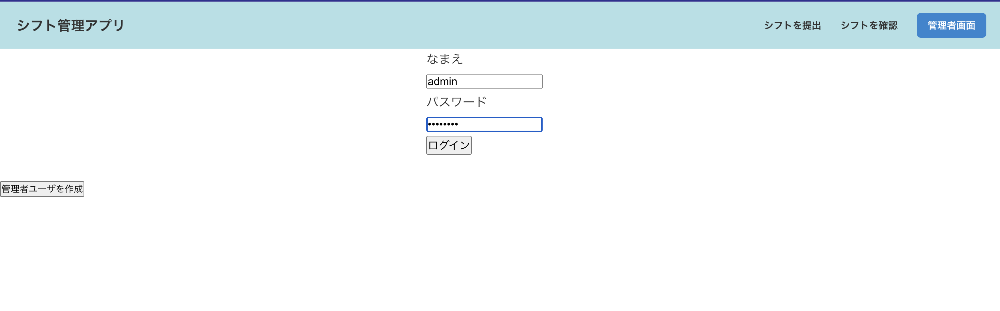
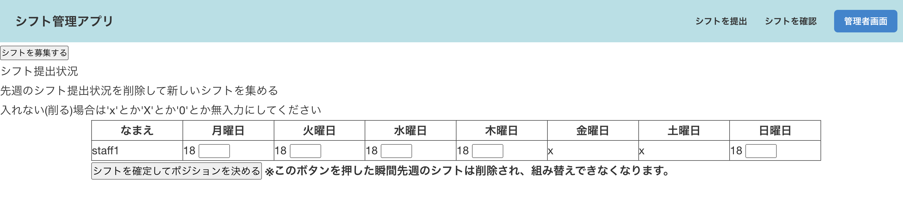
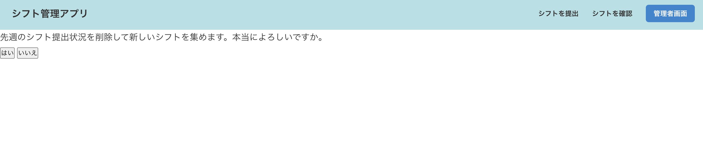
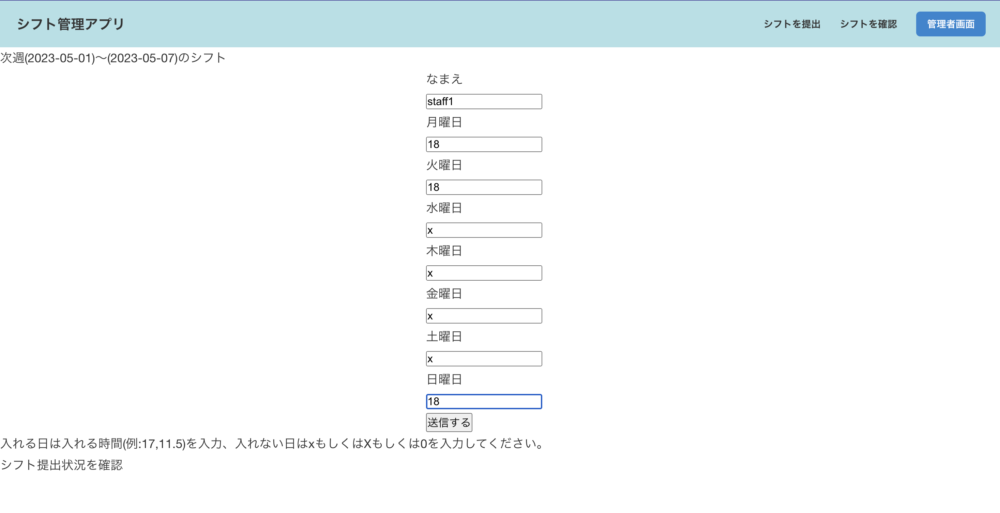
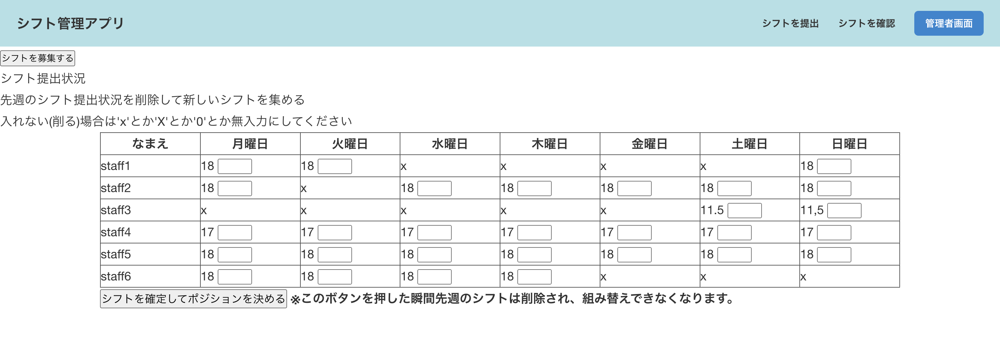
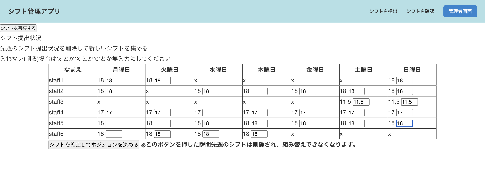
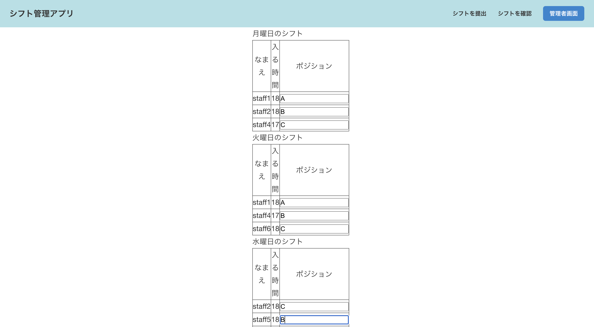
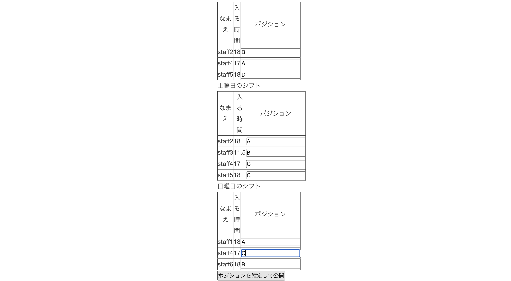
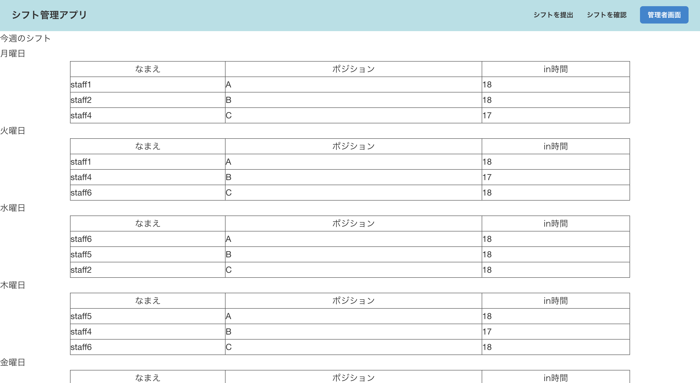
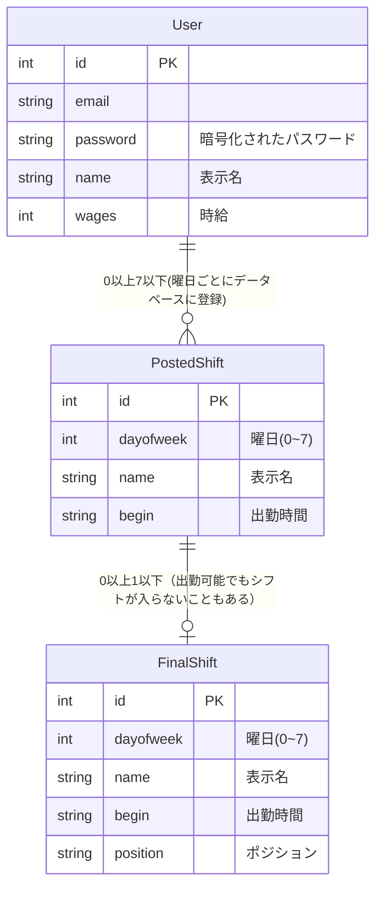

# 成果物
https://github.com/ynori123/new_sadmin

~~http://157.7.87.159~~

## 開発に至った経緯
PythonのFlaskを用いたアルバイト先のシフト管理Webアプリケーションです。アルバイト先では、シフトを提出する際、店長の個人LINEもしくは紙に書いて提出し、店長がシフトを作る際は、LINEで提出されたシフトも一度紙に書き写して整理してからExcelシートにシフトを作成し、公開するという流れでアルバイトのシフトを管理していました。私はそこに着目し、シフトの提出から公開まで1つのWebアプリケーションにすることができれば、店長の負担が軽減する上、シフトがより早くアルバイトに公開することができると考えたので、このWebアプリケーションを作成しました。

## 技術スタック
- メイン：Python Flask 2.2.3
- テンプレートエンジン：Jinja2 3.1.2
- データベース：Sqlite3
- ORM：Flask-SQLAlchemy
- 実行環境：Conoha VPS

数十人程度の従業員が使う小規模なアプリケーションのため、データベースは導入しやすいSqlite3を利用しました。

## 役割
個人開発です。仕様設計からデプロイまで私が行いました。

## 開発内容
### 概要
このシフト管理アプリは、アルバイトとして働いている従業員のシフトを管理することによって、雇用主の負担が軽減されるシステムです。

従業員は、毎週Webアプリ上のフォームで次週の勤務可能日と勤務可能時間を提出します。管理者アカウントをもつ雇用主は管理者画面から各従業員のシフトの提出状況を確認し、何時からどの従業員を働かせるかを指定します。最後に、雇用主はシフト管理画面からシフトを確定させて公開します。

今回は、最低限使える状態で公開し、1度アルバイト先の従業員さんたちに使っていただきました。そのフィードバックから得られた点を今後改善する予定です。
### 使い方
1. 雇用主は管理者画面にログインし、過去の提出されたシフトを削除して今週のシフトを募集します。

    ログイン
    
    「シフトを募集する」を選択
        
    「はい」を選択
    
1. 従業員はシフト提出画面からその週のシフトを提出します。

    
1. 雇用主は管理者画面からログインし、提出されたシフトを確認します。

    「ログイン」
    
    
1. 提出されたシフトを確認したら、誰を何時から働かせるかを入力します。

    フォーム内に何時から出勤にするかを入力します。
    
    その日は出勤させない時は、無入力もしくは'x'を入力します。
    
1. 誰を何時から働かせるかを入力したら、誰をどのポジションで働かせるかを入力します。

    
1. ポジションを入力したら、シフトを確定させて公開します。

    

1. これで従業員からシフトが確認できるようになります。

    

### 実装
1. Pythonのインストール
1. フレームワークのインストール     
    Flask, Flask-login, Flask SQLAlchemyをインストールします。
   
名前と出勤可能時間の列には、出勤できないと提出したアルバイトの情報をのぞいた`PostedShift`の内容が表示されており、それを加味して出勤させる人の出勤時間とポジションを入力することで、`FinalShift`データベースに情報が反映され、アルバイトがシフトを確認できるようになります。

### データベース

## 苦労した点
最も苦労したところは、設計です。設計する際、どうすればよりシンプルなコードでシンプルなシステムになり、店長もアルバイトもより使いやすくなるかを考えルノに苦労しました。特に工夫した点は、1度シフトを提出しても、書き換えできるようにしている点です。現在の携帯では、アルバイトは、LINEでシフトを提出した際、店長の既読がついたら店長がもうすでに紙に提出したシフトを書き写しているので、シフトを出し直せないという問題点がありました。このアプリケーションでは、店長のシフトを作成する際の負担だけでなく、その問題のようなアルバイトの負担も解消することができるように工夫しました。

## 改善点
実際にあるバイト先で一週間運用していただき、アルバイトや社員さんからフィードバックを集めたところ、パソコンでシフトを編集する店長からはすごく便利だと好評だったが、アルバイトからは、スマートフォンのUIが使いにくいとの指摘を受けたので、現在スマートフォン向けUIの改修を行っています。

